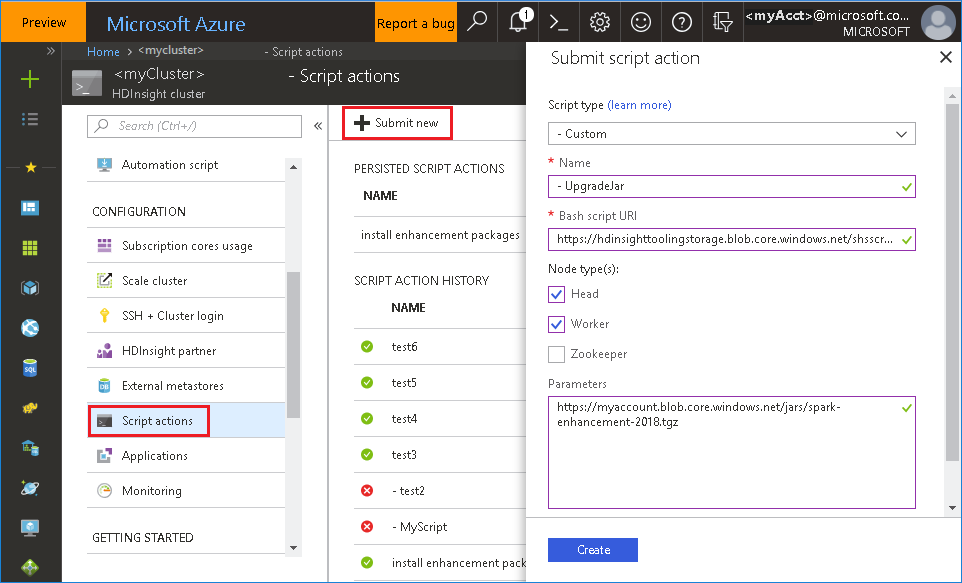
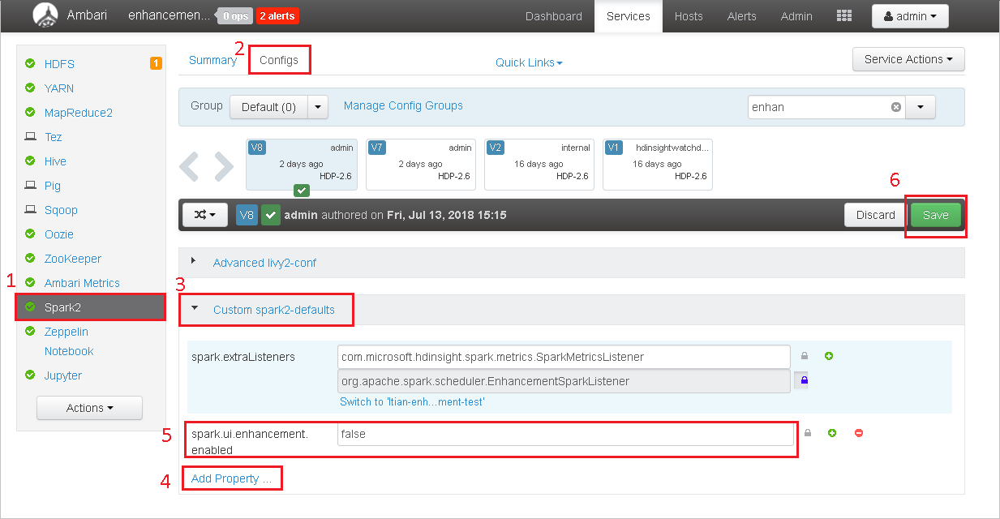
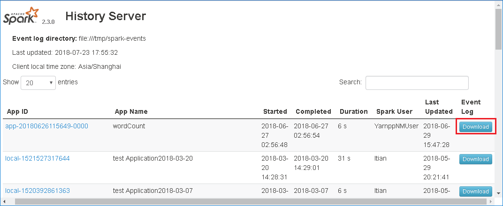
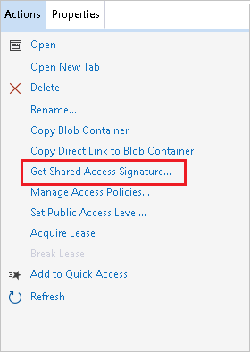
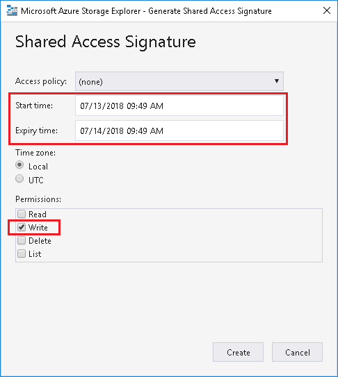
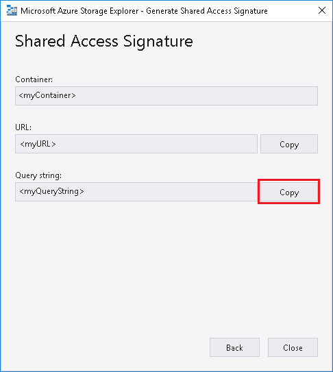
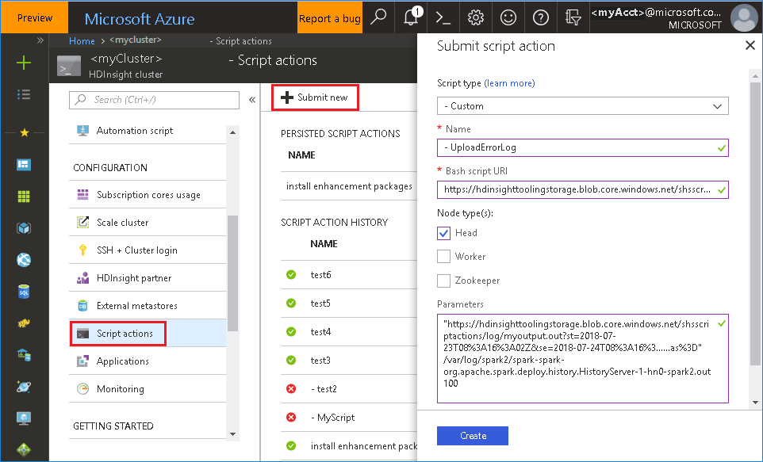

Extended Spark History Server is built on top of the community version of Spark History Server and provide advanced features. The current extension includes data tab and graph tab. Data tab shows the input/output data source of the Spark job including table operations. This allows users to validate the output, preview input schema/data to facilitate the development. Graph tab provides job graph, playback and heatmap. This helps users to understand the bottleneck, monitor and diagonose issues. Please check [Extended Spark UI documentation](https://go.microsoft.com/fwlink/?linkid=2005401) for detail information.

## 1. Hotfix extended Spark History Server

To hotfix with new version, use the script below which will download and update spark-enhancement.jar*.

**upgrade_spark_enhancement.sh**:

   ```bash
    #!/usr/bin/env bash

    # Copyright (C) Microsoft Corporation. All rights reserved.

    # Arguments:
    # $1 Enhancement jar path

    if [ "$#" -ne 1 ]; then
        >&2 echo "Please provide the upgrade jar path."
        exit 1
    fi

    install_jar() {
        tmp_jar_path="/tmp/spark-enhancement-hotfix-$( date +%s )"

        if wget -O "$tmp_jar_path" "$2"; then
            for FILE in "$1"/spark-enhancement*.jar
            do
                back_up_path="$FILE.original.$( date +%s )"
                echo "Back up $FILE to $back_up_path"
                if mv "$FILE" "$back_up_path"; then
                    echo "Copy the hotfix jar file from $tmp_jar_path to $FILE"
                    cp "$tmp_jar_path" "$FILE"
                else
                    >&2 echo "Back up $FILE failed"
                    exit 1
                fi

                echo "Copy completed. Going to restart Spark service."
                break
            done
        else    
            >&2 echo "Download jar file failed."
            exit 1
        fi
    }

    restart_spark_service() {
        USERID=$(echo -e "import hdinsight_common.Constants as Constants\nprint Constants.AMBARI_WATCHDOG_USERNAME" | python)
        echo "USERID=$USERID"

        PASSWD=$(echo -e "import hdinsight_common.ClusterManifestParser as ClusterManifestParser\nimport hdinsight_common.Constants as Constants\nimport base64\nbase64pwd = ClusterManifestParser.parse_local_manifest().ambari_users.usersmap[Constants.AMBARI_WATCHDOG_USERNAME].password\nprint base64.b64decode(base64pwd)" | python)

        CLUSTERNAME=$(echo -e "import hdinsight_common.ClusterManifestParser as ClusterManifestParser\nprint ClusterManifestParser.parse_local_manifest().deployment.cluster_name" | python)
        echo "Cluster Name=$CLUSTERNAME"

        #stop spark service, retry 3 times if fails
        n=0
        STATUSCODE=400
        until [ $STATUSCODE -le 202 ] || [ $n -gt 3 ]
        do
            STATUSCODE=$(sudo curl -u $USERID:$PASSWD -H "X-Requested-By: ambari" -i -X PUT -d '{"RequestInfo": {"context": "Stop Spark2"}, "ServiceInfo": {"state": "INSTALLED"}}' --silent --write-out %{http_code} --output /dev/restartshslog.txt https://$CLUSTERNAME.azurehdinsight.net/api/v1/clusters/$CLUSTERNAME/services/SPARK2)
            if test $STATUSCODE -le 202; then
                break
            else
                n=$[$n+1]
            fi
            sleep 5
        done
        
        if test $STATUSCODE -gt 202; then
            echo "Stopping Spark service failed for $CLUSTERNAME with $(cat /dev/restartshslog.txt)" | logger
            exit 1
        fi
        
        #start spark service, retry 3 times if fails
        n=0
        STATUSCODE=400
        until [ $STATUSCODE -le 202 ] || [ $n -gt 3 ]
        do
            STATUSCODE=$(sudo curl -u $USERID:$PASSWD -H "X-Requested-By: ambari" -i -X PUT -d '{"RequestInfo": {"context": "Start Spark2"}, "ServiceInfo": {"state": "STARTED"}}' --silent --write-out %{http_code} --output /dev/restartshslog.txt https://$CLUSTERNAME.azurehdinsight.net/api/v1/clusters/$CLUSTERNAME/services/SPARK2)
            if test $STATUSCODE -le 202; then
                break
            else
                n=$[$n+1]
            fi
            sleep 5
        done
        
        if test $STATUSCODE -gt 202; then
            echo "Restarting Spark service failed for $CLUSTERNAME with $STATUSCODE - $(cat /dev/restartshslog.txt)" | logger
            exit 1
        fi
    }

    jars_folder="/usr/hdp/current/spark2-client/jars"
    jar_path=$1

    if ls ${jars_folder}/spark-enhancement*.jar 1>/dev/null 2>&1; then
        install_jar "$jars_folder" "$jar_path"
        restart_spark_service
    else
        >&2 echo "There is no target jar on this node. Exit with no action."
        exit 0
    fi
   ```

**Usage**: 

`upgrade_spark_enhancement.sh https://${jar_path}`

**Example**:

`upgrade_spark_enhancement.sh https://${account_name}.blob.core.windows.net/packages/jars/spark-enhancement-${version}.tgz` 

**To run the bash file from Azure portal**

1. Launch [Azure Portal](https://ms.portal.azure.com), and select your cluster.
2. Click **Script actions**, then **Submit new**. Complete the **Submit script action** form, then click **Create** button.
    
    + **Script type**: select **Custom**.
    + **Name**: specify a script name.
    + **Bash script URI**: upload the bash file to private cluster then copy URL here. Alternatively, use the URI provided.
    
   ```upgrade_spark_enhancement
    https://hdinsighttoolingstorage.blob.core.windows.net/shsscriptactions/upgrade_spark_enhancement.sh
   ```

    + Check on **Head** and **Worker**.
    + **Parameters**: set the parameters follow the bash usage.

    

## 2. Revert to community version of Spark history server

To revert to community version, do the following:

1. Open cluster in Ambari. Click **Spark2** in left panel.
2. Click **Configs** tab.
3. Expand the group **Custom spark2-defaults**.
4. Click **Add Property**, add **spark.ui.enhancement.enabled=false**, save.
5. The property sets to **false** now.
6. Click **Save** to save the configuration.

    

7. Click **Spark2** in left panel, under **Summary** tab, click **Spark2 History Server**.

     

8. Restart history server by clicking **Restart** of **Spark2 History Server**.

      

9. Refresh the Spark history server web UI, it will be reverted to community version.


## 3. Collect history server events for diagnosis 

If you run into history server error, follow the steps below to collect the Spark event:
1. Download event by clicking **Download** in history server web UI.

    

2. Click **Provide us feedback** from data/graph tab.

    

3. Provide the title and description of error, drag the zip file to the edit field, then click **Submit new issue**.

    


## 4. Upload history server log using script action

If you run into history server error, use the script below which will upload the history server log to the blob storage specified by us (who is working on investigating the history server issues). 

**upload_shs_log.sh**:

   ```bash
    #!/usr/bin/env bash

    # Copyright (C) Microsoft Corporation. All rights reserved.

    # Arguments:
    # $1 Blob link with SAS token query string 
    # $2 Log path
    # $3 Max log file size in MB

    if [ "$#" -ne 3 ]; then
        >&2 echo "$@"
        >&2 echo "Please provide Azure Storage link, log path and max log size."
        exit 1
    fi

    blob_link=$1
    log_path=$2
    max_log_size=$3

    if ! [ -e "$log_path" ]; then
        >&2 echo "There is no log path $log_path on this node"
        exit 0 
    fi

    tail -c $((1024*1024*max_log_size)) \
        "$log_path" > /tmp/shs_log_for_trouble_shooting.log

    curl -T /tmp/shs_log_for_trouble_shooting.log \
        -X PUT \
        -H "x-ms-date: $(date -u)" \
        -H "x-ms-blob-type: BlockBlob" \
        "$blob_link"
   ```

**Usage**: 

`upload_shs_log.sh "${blob_link}" ${log_path} ${log_max_MB_size}`

**Example**:

`upload_shs_log.sh "https://${account_name}.blob.core.windows.net/${blob_container}/${log_file}{SAS_query_string}" /var/log/spark2/spark-spark-org.apache.spark.deploy.history.HistoryServer-1-{head_node_alias}-spark2.out 100`

For **head_node_alias**, it may be **hn0** or **hn1** for a cluster with two head nodes. Fill in the active head node alias.

For **log_file**, specify by customer.

For **SAS_query_string**, you can get it from ASE: 
1.  Right-click the container you want to use and choose **Get Shared Access Signature…**:

    

2.  Choose permissions with **Write** and adjust the **Start time** and **Expiry time**:

    

3.  Click **Copy** to copy the query string:

    

**To run the bash file from Azure portal**

1. Launch [Azure Portal](https://ms.portal.azure.com), and select your cluster.
2. Click **Script actions**, then **Submit new**. Complete the **Submit script action** form, then click **Create** button.
    
    + **Script type**: select **Custom**.
    + **Name**: specify a script name.
    + **Bash script URI**: upload the bash file to private cluster then copy URL here. Alternatively, use the URI provided.

   ```upload_shs_log
    https://hdinsighttoolingstorage.blob.core.windows.net/shsscriptactions/upload_shs_log.sh
   ```

    + Check on **Head**.
    + **Parameters**: set the parameters follow the bash usage.

    
